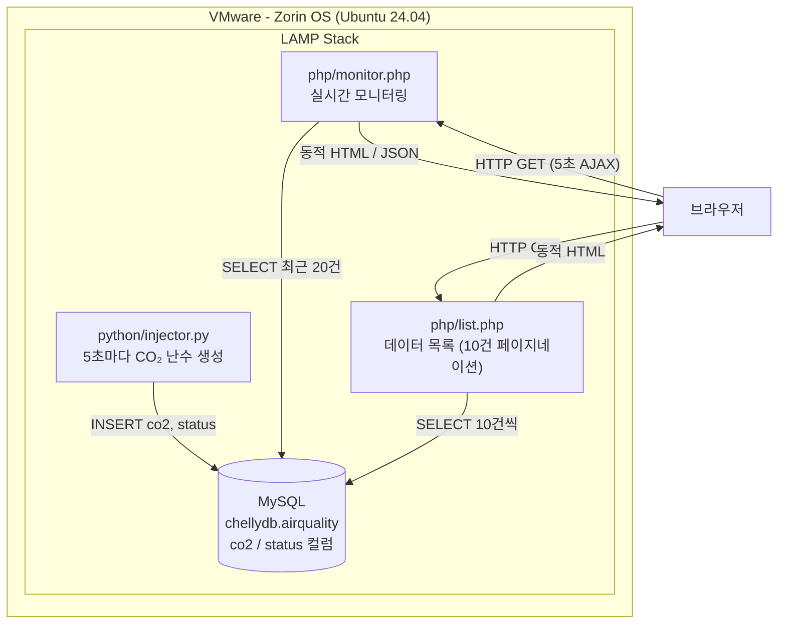

# LAMP Stack 실시간 공기질 모니터링

## 프로젝트 개요

VMware 위의 Zorin OS(Ubuntu 24.04)에 LAMP 스택을 구축하고,
Python으로 가상 CO₂ 농도 데이터를 생성하여 MySQL에 저장한 뒤
PHP로 실시간 모니터링 페이지를 제공하는 시스템입니다.

---

## 시스템 블록도



---

## CO₂ 농도 기준

| 범위 | 상태 | 색상 |
|------|------|------|
| 400 ~ 599 ppm | 좋음 | 🟢 |
| 600 ~ 999 ppm | 보통 | 🟡 |
| 1000 ~ 1499 ppm | 나쁨 | 🟠 |
| 1500 ~ 2000 ppm | 위험 | 🔴 |

---

## 디렉터리 구조

```
mysql_php/
├── python/
│   └── injector.py          # CO₂ 데이터 생성 및 MySQL 저장
├── php/
│   ├── monitor.php          # 실시간 모니터링 (Chart.js 그래프)
│   └── list.php             # 전체 데이터 목록 (10건 페이지네이션)
├── pyproject.toml
├── process.md
└── README.md
```

---

## 설치 및 실행 방법

### 1. LAMP 스택 설치

```bash
sudo apt update
sudo apt install apache2 mysql-server php php-mysqli -y
```

### 2. MySQL 사용자 및 DB 설정

```bash
sudo mysql
```
```sql
CREATE USER 'chellydb'@'localhost' IDENTIFIED BY 'jjk00jjk';
CREATE DATABASE chellydb;
GRANT ALL PRIVILEGES ON chellydb.* TO 'chellydb'@'localhost';
FLUSH PRIVILEGES;
exit
```

### 3. Python 의존성 설치

```bash
pip3 install mysql-connector-python
```

### 4. PHP 파일 배포

```bash
sudo cp php/monitor.php /var/www/html/monitor.php
sudo cp php/list.php    /var/www/html/list.php
```

### 5. 데이터 주입 시작

```bash
python3 python/injector.py
```

### 6. 브라우저에서 확인

```
http://localhost/monitor.php   # 실시간 모니터링
http://localhost/list.php      # 전체 데이터 목록
```
