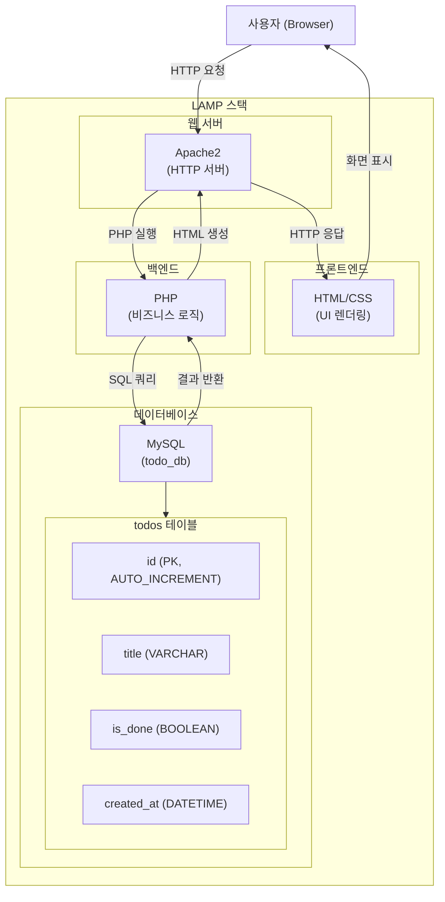
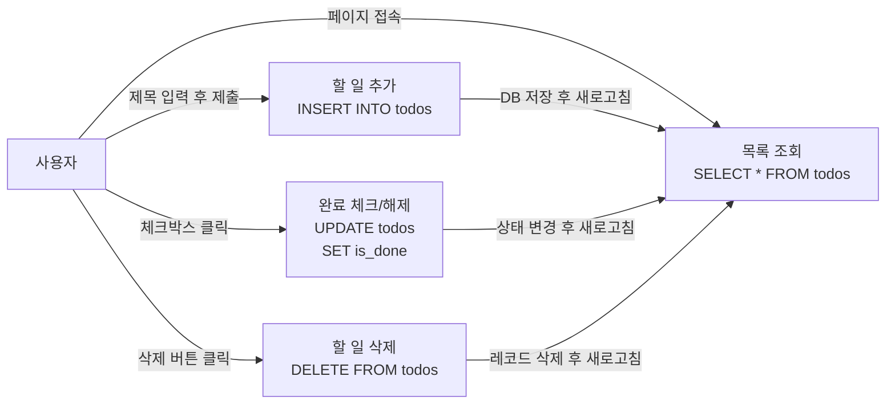

# To-Do List 앱 구조

## 전체 아키텍처

## 주요 기능 흐름

## 기술 스택

| 계층 | 기술 | 역할 |
|------|------|------|
| OS | Linux (Zorin OS) | 운영 환경 |
| 웹 서버 | Apache2 | HTTP 요청 처리 |
| 백엔드 | PHP | 비즈니스 로직 / DB 연동 |
| 데이터베이스 | MySQL | 데이터 저장 및 관리 |
| 프론트엔드 | HTML / CSS | UI 렌더링 |
